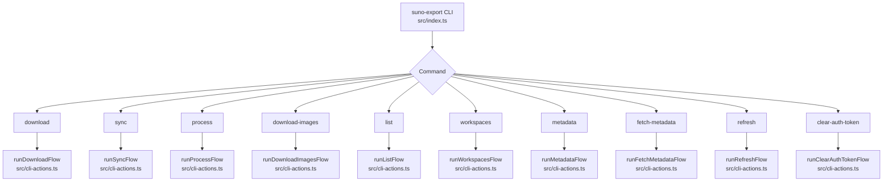
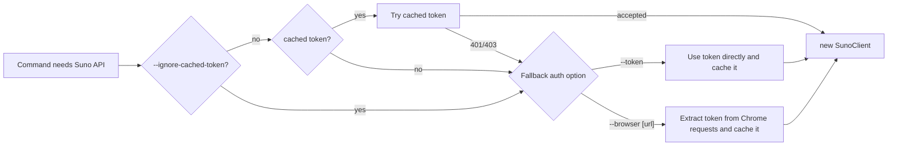
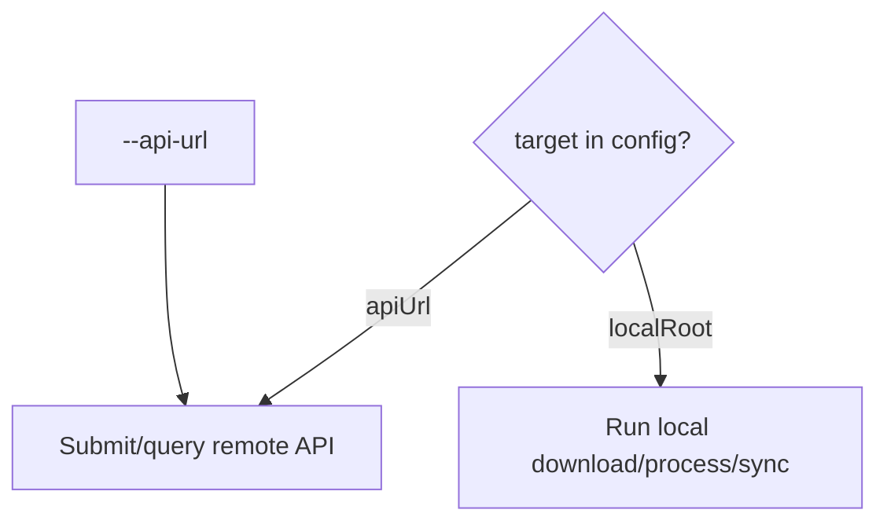
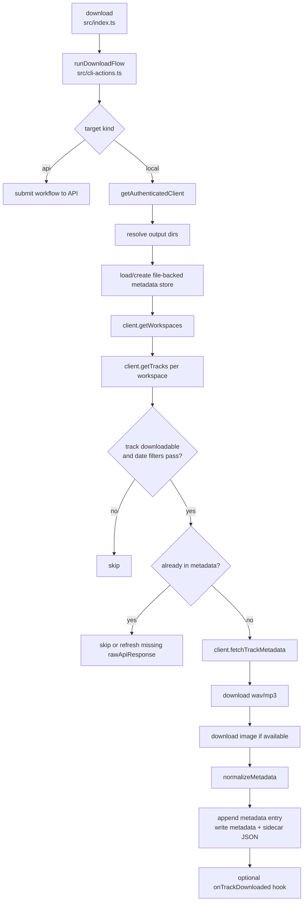
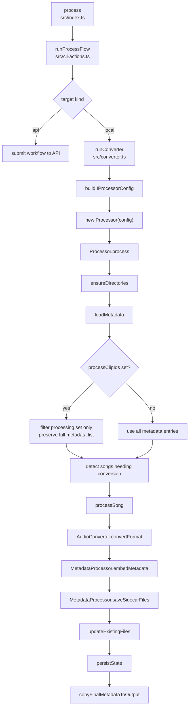
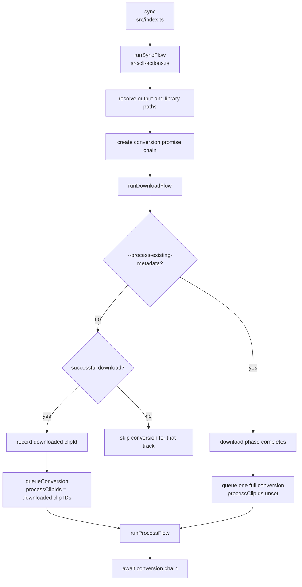
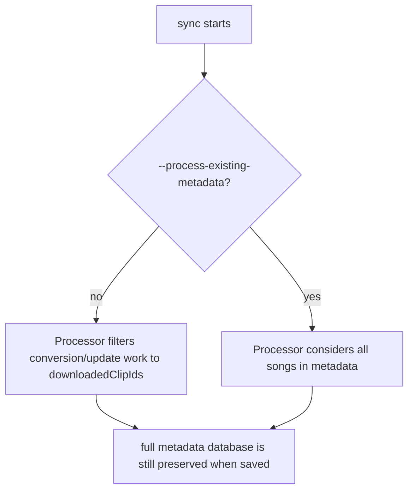
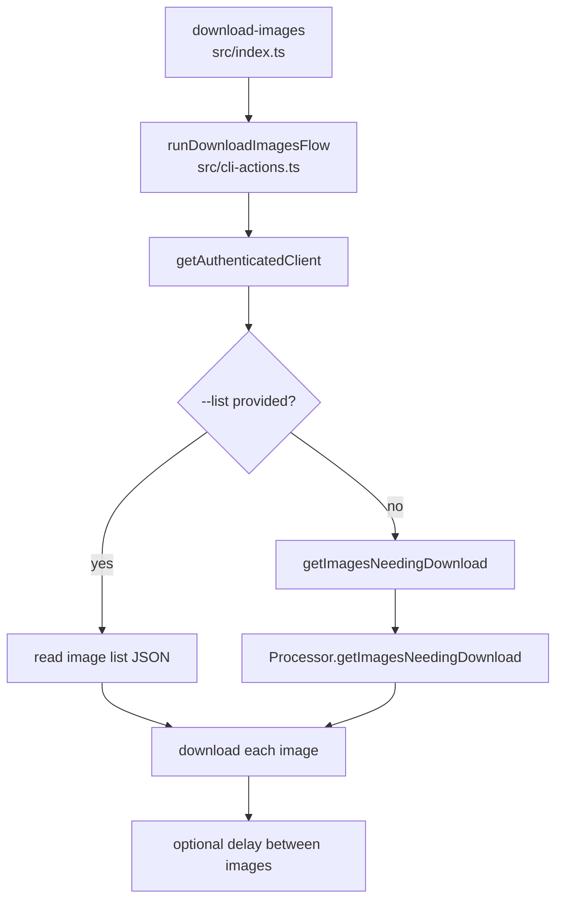
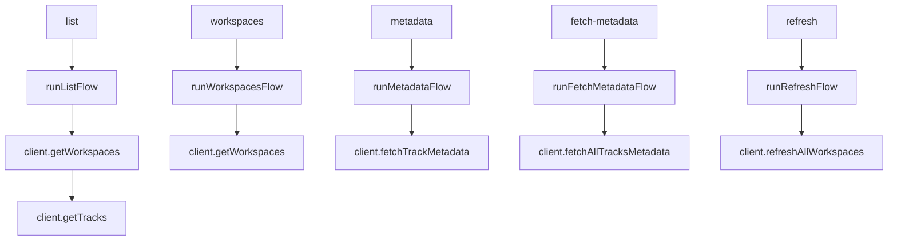

# CLI Program Flow

This document maps the `suno-export` command surface to the modules and methods
that implement each workflow. It is intended as a maintenance guide for tracing
where behavior lives.

## Top-Level Dispatch

`src/index.ts` defines the CLI with Commander. Each command registers options and
then dispatches to a flow function in `src/cli-actions.ts` through
`withCliError(...)`.

### Dispatch Notes

- `src/index.ts`
  - `program.command("download")`: command registration for download.
  - `program.command("sync")`: command registration for download plus process.
  - `program.command("process")`: command registration for converter-only runs.
  - `program.command("download-images")`: command registration for artwork fetches.
  - `program.command("clear-auth-token")`: command registration for auth-token
    cache clearing.
  - `withCliError(...)`: shared error wrapper that prints the error and exits.
- `src/cli-defaults.ts`
  - `DEFAULT_DOWNLOAD_ROOT`: default output root for commands with `--output`.

## Authentication Flow

Most commands that contact Suno call `getAuthenticatedClient(options)` before
doing API work.

### Authentication Notes

- `src/cli-actions.ts`
  - `getAuthenticatedClient(options)`: central auth entrypoint for CLI flows.
  - Cached tokens are read from `Storage` first unless `--ignore-cached-token`
    is set. A cached token is accepted after a lightweight workspace-page
    request succeeds.
  - Tokens supplied by `--token` or extracted through `--browser` are written
    back to the cache by default.
  - `runClearAuthTokenFlow()`: deletes only the cached auth token, leaving other
    cached track/metadata data intact.
  - `resolveBrowserEndpoint(options)`: handles `--browser` defaulting.
  - `resolveBrowserUserDataDir(options)`: resolves `--browser-profile`.
  - `resolveBrowserProfileDirectory(options)`: resolves `--profile-directory`.
- `src/auth.ts`
  - `extractTokenFromBrowser(...)`: launches/connects to Chrome and captures a
    bearer token from Suno network requests.
- `src/client.ts`
  - `SunoClient`: API client used after authentication.

## Target Resolution

The user-facing workflow commands now resolve a target from either `--api-url`
or `suno-export.config.json`. The config file must contain exactly one of:

- `target.apiUrl`
- `target.localRoot`

When `target.localRoot` is configured, `download`, `process`, and `sync` run
directly against local folders and `songs_metadata.json`. When `target.apiUrl`
is configured, the workflow and inspection commands talk to the remote API.

## Metadata Storage Rule

For normal local workflow execution, the authoritative metadata store is now
`songs_metadata.json` under the local root. SQLite/Postgres metadata stores
remain available for API/runtime paths and compatibility commands.

### Metadata Storage Notes

- `src/workflow-target-config.ts`
  - Loads `suno-export.config.json` by default, or `--config <path>` when
    provided.
- `src/index.ts`
  - Registers `--config <path>` for `download`, `sync`, `process`, and the
    API-oriented user commands, plus local inspection commands that persist
    workspace metadata.
  - Keeps `import-metadata-json` and `export-metadata-json` as compatibility
    commands for direct metadata-store maintenance.
- `src/cli-actions.ts`
  - `resolveMetadataStoreOptions(options)`: chooses file-backed metadata for
    `localRoot` workflows and database-backed metadata for API/runtime or
    compatibility paths.
  - `runDownloadFlow(...)`, `runProcessFlow(...)`, and `runSyncFlow(...)`:
    dispatch locally for `localRoot`, or submit/query the API for `apiUrl`.
  - `runImportMetadataJsonFlow(...)`: imports existing `songs_metadata.json`
    arrays into the selected metadata store.
  - `runExportMetadataJsonFlow(...)`: exports metadata store data back to the current
    JSON array format.
- `src/converter.ts`
  - `runConverter(options)`: maps `metadataDatabase` to
    `IProcessorConfig.metadataDatabasePath`.
- `src/library-processor.ts`
  - `Processor.loadMetadata()`: reads and normalizes metadata from the selected
    metadata store.
  - `Processor.saveMetadata()`: persists full metadata to the selected metadata
    store.
  - `Processor.copyFinalMetadataToOutput()`: optionally exports finalized
    metadata JSON to the output root.
- `src/metadata-store.ts`
  - `JsonMetadataStore`: file-backed metadata store for `songs_metadata.json`.
  - `SqliteMetadataStore`: SQLite-backed metadata store.
  - `PostgresMetadataStore`: Postgres-backed metadata store.
  - Schema is normalized into `songs`, `song_tags`, `song_negative_tags`, and
    `song_mashup_sources`; only the nested Suno API response remains JSON.
  - Suno project/workspace loads are upserted into `workspaces` through
    `SqliteMetadataStore.upsertWorkspaces(...)`; `IWorkspace` extends the
    project-shaped `ITrackProject` data.
  - Song/workspace membership is written to `song_workspaces`, derived from
    `rawApiResponse.project` when saving metadata and from workspace discovery
    when listing tracks.
  - Existing first-pass SQLite databases with `metadata_entries.metadata_json`
    are migrated into the normalized tables when opened.
  - `importMetadataJsonToDatabase(...)`: JSON-to-store import helper.
  - `exportMetadataDatabaseToJson(...)`: metadata-store-to-JSON export helper.

## Download Command

`download` fetches Suno tracks, metadata, audio, and artwork into a download-style
folder layout.

### Download Notes

- `src/cli-actions.ts`
  - `runDownloadFlow(options)`: resolves local vs API execution.
  - `runDownloadWorkflow(options)`: owns the local download workflow.
  - `getCreatedAtFilters(options)`: parses `--created-after` and
    `--created-before`.
  - `isTrackInDateWindow(...)`: applies date filters to each track.
  - `getPreferredImageUrl(...)`: picks the best artwork URL from metadata.
  - `DownloadedTrackHook`: callback shape used by sync to queue conversion.
- `src/client.ts`
  - `SunoClient.getWorkspaces()`: fetches workspaces.
  - `SunoClient.getTracks(workspaceId)`: fetches tracks for a workspace.
  - `SunoClient.fetchTrackMetadata(trackId)`: fetches detailed metadata.
  - `SunoClient.downloadWav(...)`, `downloadMp3(...)`, `downloadImage(...)`:
    asset download helpers.
- `src/lib/metadata/normalize-metadata.ts`
  - `normalizeMetadata(...)`: canonicalizes metadata entries before writing.

## Process Command

`process` runs the converter against an existing download-style input root, or
submits the remote API workflow when the target is an API.

### Process Notes

- `src/cli-actions.ts`
  - `runProcessFlow(options)`: adapts CLI options to converter options.
- `src/converter.ts`
  - `runConverter(options)`: builds `IProcessorConfig`, initializes logging, and
    creates `Processor`.
- `src/library-processor.ts`
  - `Processor.process()`: top-level processing coordinator.
  - `Processor.ensureDirectories()`: creates output folders.
  - `Processor.loadMetadata()`: loads and normalizes combined metadata.
  - `Processor.getProcessSongs(...)`: filters by `processClipIds` when present.
  - `Processor.resolveSourceWavPath(...)`: finds source WAV in input or output.
  - `Processor.shouldConvert(...)`: decides whether a format should be created.
  - `Processor.processSong(...)`: per-song conversion and sidecar workflow.
  - `Processor.updateExistingFiles(...)`: refreshes existing converted files in
    the selected processing set.
  - `Processor.persistState()`: serializes metadata/log writes.
- `src/audio-converter.ts`
  - `AudioConverter.convertFormat(...)`: ffmpeg conversion primitive.
- `src/metadata-processor.ts`
  - `MetadataProcessor.embedMetadata(...)`: dispatches metadata embedding by
    format.
  - `MetadataProcessor.saveSidecarFiles(...)`: writes per-track metadata, lyrics,
    and artwork sidecars.

## Sync Command

`sync` chains download and process. By default, conversion is queued after
successful downloads and limited to clips downloaded during the current run.
`--process-existing-metadata` runs one full metadata processing pass after the
download phase.

### Sync Notes

- `src/index.ts`
  - Registers `--process-existing-metadata` on `sync`.
- `src/cli-actions.ts`
  - `runSyncFlow(options)`: owns the chained workflow.
  - `downloadedClipIds`: local `Set<string>` tracking successful downloads in
    the current sync run.
  - `queueConversion()`: serializes converter runs through `conversionChain`.
  - `onTrackDownloaded`: hook passed into `runDownloadFlow` to record a clip ID
    and queue conversion.
- `src/library-processor.ts`
  - `Processor.getProcessTargetClipIds()`: builds the selected clip-id set.
  - `Processor.getProcessSongs(...)`: restricts conversion/update work to those
    IDs while preserving the full metadata list when saving.

### Sync Processing Scope

Important behavior:

- Existing entries in the metadata database remain in memory and are written back
  when metadata is persisted.
- By default, only tracks downloaded during that sync run are considered for
  conversion and update work.
- With `--process-existing-metadata`, sync re-processes all metadata entries
  after the download phase completes.

## Download Images Command

`download-images` downloads artwork either from a JSON list or by discovering
missing images from metadata.

### Download Images Notes

- `src/cli-actions.ts`
  - `runDownloadImagesFlow(options)`: validates image-list/discovery options and
    downloads artwork.
  - `getImagesNeedingDownload(rootDir, databasePath)`: creates a `Processor`
    solely for missing-image discovery.
- `src/library-processor.ts`
  - `Processor.getImagesNeedingDownload()`: loads metadata, checks image
    presence/validity in input and output image folders, and returns missing
    items.
- `src/client.ts`
  - `SunoClient.downloadImage(...)`: downloads the selected artwork URL.

## Lightweight API Commands

These commands primarily authenticate and call `SunoClient` methods.

### Lightweight Command Notes

- `src/cli-actions.ts`
  - `runListFlow(options)`: lists tracks, optionally as JSON.
  - `runWorkspacesFlow(options)`: lists workspaces, optionally as JSON.
  - Both commands also persist discovered workspaces and workspace-track links
    through the selected metadata store, so `--config` can point them at a
    `localRoot`.
  - `runMetadataFlow(trackId, options)`: prints metadata for one track.
  - `runFetchMetadataFlow(options)`: fetches metadata for explicit IDs or tracks
    selected by workspace/date filters.
  - `runRefreshFlow(options)`: refreshes cached workspace data.
- `src/client.ts`
  - `SunoClient.fetchAllTracksMetadata(...)`: batch metadata fetch.
  - `SunoClient.refreshAllWorkspaces()`: refresh helper for workspace data.

## Output Ownership

Download-style output root:

- `mp3/`: downloaded MP3 source files.
- `wav/`: downloaded WAV source files.
- `metadata/`: per-track metadata sidecar JSON.
- `images/`: downloaded artwork.
- `songs_metadata.json`: authoritative metadata file for `localRoot` workflows.
- `data/suno-export.sqlite`: compatibility metadata store when using
  SQLite-backed commands explicitly.

Process output root:

- Audio format folders such as `flac/`, `mp3/`, `alac/`, and optionally `wav/`.
- `metadata/`: processed metadata sidecars and temporary tag files.
- `lyrics/`: lyric sidecars.
- `images/`: copied/downloaded artwork.

Authoritative combined metadata:

- `localRoot` workflows use `songs_metadata.json`.
- Compatibility and runtime-oriented flows may still use SQLite or Postgres.
- `--database <path>` overrides the SQLite metadata store location when those
  compatibility flows are used.
- `--config <path>` can point local-facing commands at a `localRoot`.
- `--import-metadata-json` and `--export-metadata-json` bridge the previous
  `songs_metadata.json` format and the selected metadata store.
