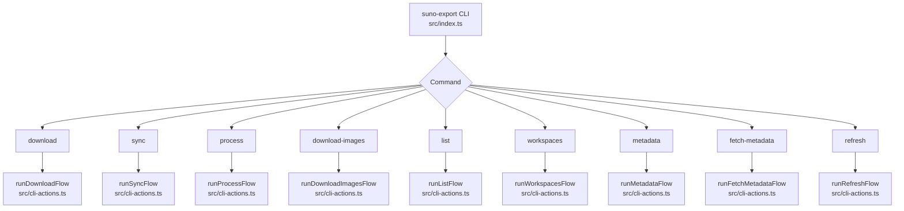
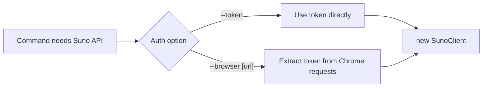
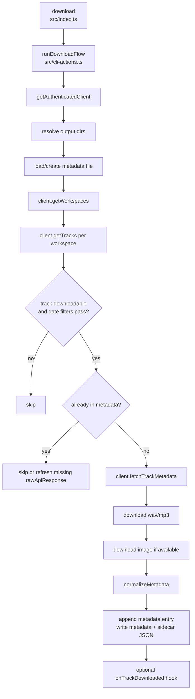
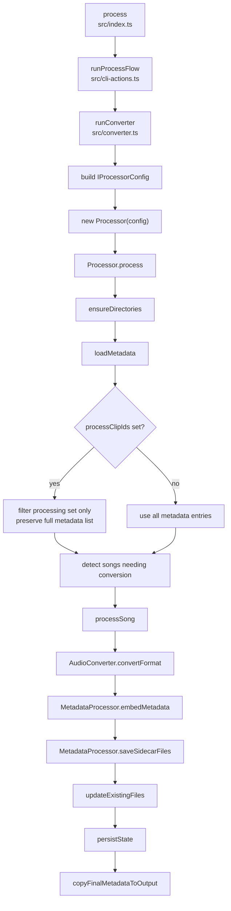
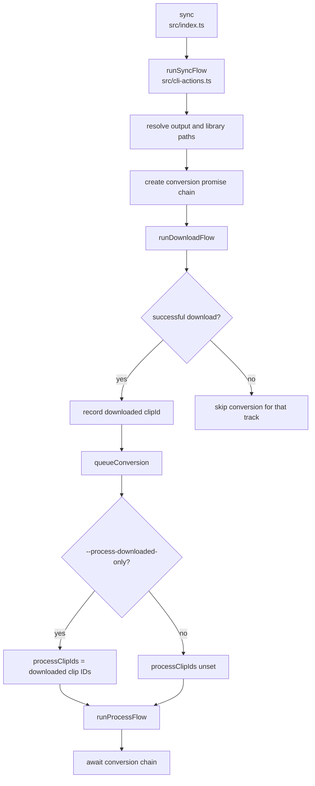
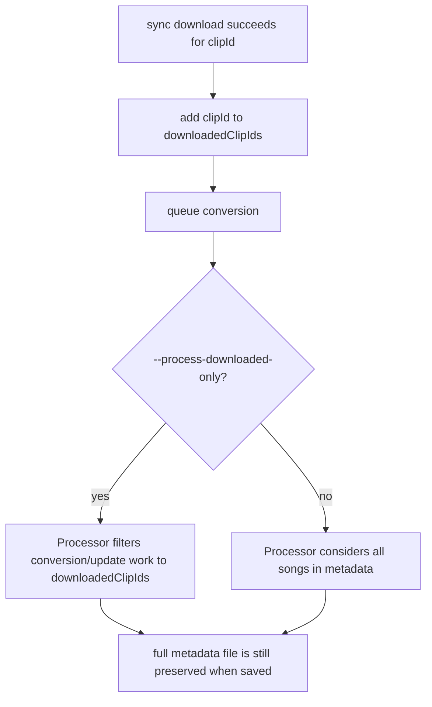
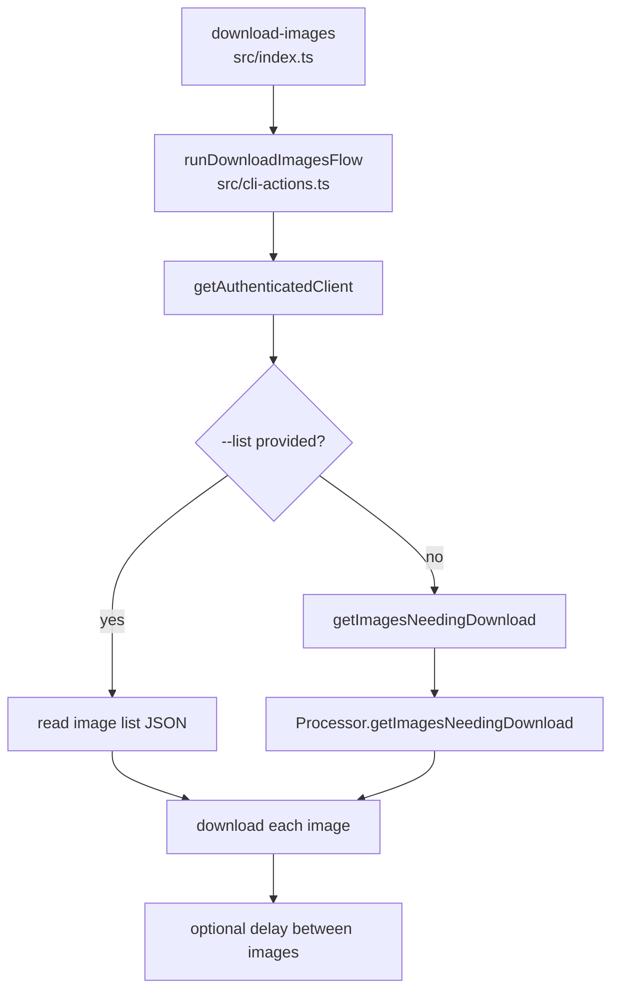
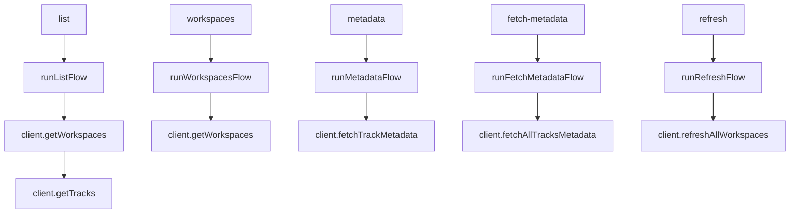

# CLI Program Flow

This document maps the `suno-export` command surface to the modules and methods
that implement each workflow. It is intended as a maintenance guide for tracing
where behavior lives.

## Top-Level Dispatch

`src/index.ts` defines the CLI with Commander. Each command registers options and
then dispatches to a flow function in `src/cli-actions.ts` through
`withCliError(...)`.

### Dispatch Notes

- `src/index.ts`
  - `program.command("download")`: command registration for download.
  - `program.command("sync")`: command registration for download plus process.
  - `program.command("process")`: command registration for converter-only runs.
  - `program.command("download-images")`: command registration for artwork fetches.
  - `withCliError(...)`: shared error wrapper that prints the error and exits.
- `src/cli-defaults.ts`
  - `DEFAULT_DOWNLOAD_ROOT`: default output root for commands with `--output`.

## Authentication Flow

Most commands that contact Suno call `getAuthenticatedClient(options)` before
doing API work.

### Authentication Notes

- `src/cli-actions.ts`
  - `getAuthenticatedClient(options)`: central auth entrypoint for CLI flows.
  - `resolveBrowserEndpoint(options)`: handles `--browser` defaulting.
  - `resolveBrowserUserDataDir(options)`: resolves `--browser-profile`.
  - `resolveBrowserProfileDirectory(options)`: resolves `--profile-directory`.
- `src/auth.ts`
  - `extractTokenFromBrowser(...)`: launches/connects to Chrome and captures a
    bearer token from Suno network requests.
- `src/client.ts`
  - `SunoClient`: API client used after authentication.

## Metadata File Path Rule

The combined metadata JSON file defaults to `songs_metadata.json`, but callers
can override the path with `--metadata-file`.

```mermaid
flowchart TD
  A{"--metadata-file set?"}
  A -- yes --> B["Use provided absolute/resolved path"]
  A -- "no, download/sync/download-images" --> C["<output>/songs_metadata.json"]
  A -- "no, process" --> D["<input>/songs_metadata.json"]
```

### Metadata Path Notes

- `src/index.ts`
  - Registers `--metadata-file <path>` on `download`, `sync`, `process`, and
    `download-images`.
- `src/cli-actions.ts`
  - `resolveMetadataFilePath(rootDir, options)`: resolves the download-side
    metadata file path.
  - `runDownloadFlow(...)`: reads, initializes, normalizes, and writes the
    metadata file during download.
  - `runProcessFlow(...)`: passes `metadataFile` into the converter.
  - `runDownloadImagesFlow(...)`: uses the metadata file for missing-image
    discovery.
- `src/converter.ts`
  - `runConverter(options)`: maps `metadataFile` to
    `IProcessorConfig.metadataFilePath`.
- `src/library-processor.ts`
  - `Processor.getMetadataFilePath()`: resolves the processor's authoritative
    metadata file.
  - `Processor.loadMetadata()`: reads and normalizes metadata.
  - `Processor.saveMetadata()`: persists full metadata with tmp plus rename.
  - `Processor.copyFinalMetadataToOutput()`: optionally copies finalized metadata
    to the output root.

## Download Command

`download` fetches Suno tracks, metadata, audio, and artwork into a download-style
folder layout.

### Download Notes

- `src/cli-actions.ts`
  - `runDownloadFlow(options)`: owns the download workflow.
  - `getCreatedAtFilters(options)`: parses `--created-after` and
    `--created-before`.
  - `isTrackInDateWindow(...)`: applies date filters to each track.
  - `getPreferredImageUrl(...)`: picks the best artwork URL from metadata.
  - `DownloadedTrackHook`: callback shape used by sync to queue conversion.
- `src/client.ts`
  - `SunoClient.getWorkspaces()`: fetches workspaces.
  - `SunoClient.getTracks(workspaceId)`: fetches tracks for a workspace.
  - `SunoClient.fetchTrackMetadata(trackId)`: fetches detailed metadata.
  - `SunoClient.downloadWav(...)`, `downloadMp3(...)`, `downloadImage(...)`:
    asset download helpers.
- `src/lib/metadata/normalize-metadata.ts`
  - `normalizeMetadata(...)`: canonicalizes metadata entries before writing.

## Process Command

`process` runs the converter against an existing download-style input root.

### Process Notes

- `src/cli-actions.ts`
  - `runProcessFlow(options)`: adapts CLI options to converter options.
- `src/converter.ts`
  - `runConverter(options)`: builds `IProcessorConfig`, initializes logging, and
    creates `Processor`.
- `src/library-processor.ts`
  - `Processor.process()`: top-level processing coordinator.
  - `Processor.ensureDirectories()`: creates output folders.
  - `Processor.loadMetadata()`: loads and normalizes combined metadata.
  - `Processor.getProcessSongs(...)`: filters by `processClipIds` when present.
  - `Processor.resolveSourceWavPath(...)`: finds source WAV in input or output.
  - `Processor.shouldConvert(...)`: decides whether a format should be created.
  - `Processor.processSong(...)`: per-song conversion and sidecar workflow.
  - `Processor.updateExistingFiles(...)`: refreshes existing converted files in
    the selected processing set.
  - `Processor.persistState()`: serializes metadata/log writes.
- `src/audio-converter.ts`
  - `AudioConverter.convertFormat(...)`: ffmpeg conversion primitive.
- `src/metadata-processor.ts`
  - `MetadataProcessor.embedMetadata(...)`: dispatches metadata embedding by
    format.
  - `MetadataProcessor.saveSidecarFiles(...)`: writes per-track metadata, lyrics,
    and artwork sidecars.

## Sync Command

`sync` chains download and process. Conversion is queued after successful
downloads.

### Sync Notes

- `src/index.ts`
  - Registers `--process-downloaded-only` on `sync`.
- `src/cli-actions.ts`
  - `runSyncFlow(options)`: owns the chained workflow.
  - `downloadedClipIds`: local `Set<string>` tracking successful downloads in
    the current sync run.
  - `queueConversion()`: serializes converter runs through `conversionChain`.
  - `onTrackDownloaded`: hook passed into `runDownloadFlow` to record a clip ID
    and queue conversion.
- `src/library-processor.ts`
  - `Processor.getProcessTargetClipIds()`: builds the selected clip-id set.
  - `Processor.getProcessSongs(...)`: restricts conversion/update work to those
    IDs while preserving the full metadata list when saving.

### `--process-downloaded-only`

Important behavior:

- Existing entries in the metadata file remain in memory and are written back
  when metadata is persisted.
- With `--process-downloaded-only`, only tracks downloaded during that sync run
  are considered for conversion and update work.
- Without `--process-downloaded-only`, sync keeps the previous behavior and
  allows the processor to consider all metadata entries.

## Download Images Command

`download-images` downloads artwork either from a JSON list or by discovering
missing images from metadata.

### Download Images Notes

- `src/cli-actions.ts`
  - `runDownloadImagesFlow(options)`: validates image-list/discovery options and
    downloads artwork.
  - `getImagesNeedingDownload(rootDir, metadataFilePath)`: creates a `Processor`
    solely for missing-image discovery.
- `src/library-processor.ts`
  - `Processor.getImagesNeedingDownload()`: loads metadata, checks image
    presence/validity in input and output image folders, and returns missing
    items.
- `src/client.ts`
  - `SunoClient.downloadImage(...)`: downloads the selected artwork URL.

## Lightweight API Commands

These commands primarily authenticate and call `SunoClient` methods.

### Lightweight Command Notes

- `src/cli-actions.ts`
  - `runListFlow(options)`: lists tracks, optionally as JSON.
  - `runWorkspacesFlow(options)`: lists workspaces, optionally as JSON.
  - `runMetadataFlow(trackId, options)`: prints metadata for one track.
  - `runFetchMetadataFlow(options)`: fetches metadata for explicit IDs or tracks
    selected by workspace/date filters.
  - `runRefreshFlow(options)`: refreshes cached workspace data.
- `src/client.ts`
  - `SunoClient.fetchAllTracksMetadata(...)`: batch metadata fetch.
  - `SunoClient.refreshAllWorkspaces()`: refresh helper for workspace data.

## Output Ownership

Download-style output root:

- `mp3/`: downloaded MP3 source files.
- `wav/`: downloaded WAV source files.
- `metadata/`: per-track metadata sidecar JSON.
- `images/`: downloaded artwork.
- `songs_metadata.json`: default combined metadata file.

Process output root:

- Audio format folders such as `flac/`, `mp3/`, `alac/`, and optionally `wav/`.
- `metadata/`: processed metadata sidecars and temporary tag files.
- `lyrics/`: lyric sidecars.
- `images/`: copied/downloaded artwork.

Authoritative combined metadata:

- Download uses `<output>/songs_metadata.json` by default.
- Process uses `<input>/songs_metadata.json` by default.
- `--metadata-file <path>` overrides the combined metadata JSON location.
- Processor backups are created next to the authoritative metadata file.
