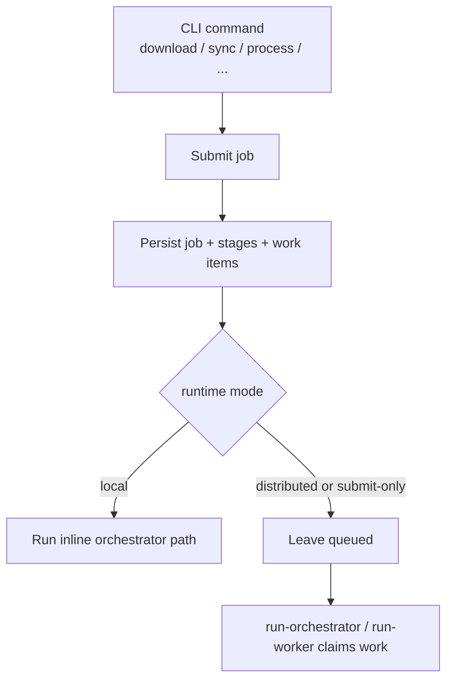
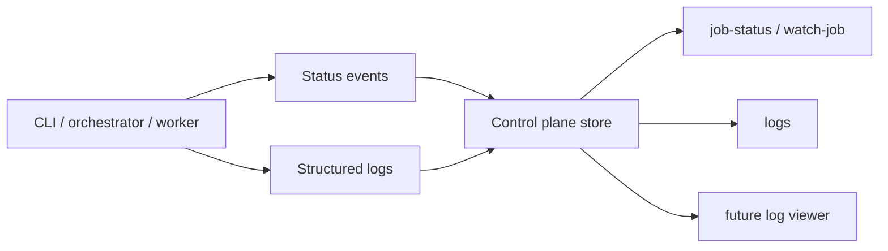

# Orchestration Runtime

This document describes how the refactored `suno-export` runtime is organized
today and how it maps to the later Postgres and multi-container deployment
model.

## Goals

The orchestration layer is designed around the same rules regardless of whether
it runs on one machine or many:

- authorization must complete before acquisition starts
- metadata acquisition and asset acquisition are globally exclusive
- processing can run in parallel, with limits
- conversion can run in parallel, with its own limits
- status and logs must be queryable outside the worker that emitted them

## Runtime Modes

Workflow commands such as `download`, `sync`, `process`, `download-images`,
`fetch-metadata`, and `refresh` now support two execution styles:

- `local`: submit the job and execute it in the current process
- `distributed`: submit the job and return immediately so another orchestrator
  or worker process can pick it up

The command-line switches are:

- `--runtime-mode local|distributed`
- `--submit-only`

`--submit-only` is useful even in local development when you want to queue work
in one terminal and inspect or execute it from another.

## Current Local Control Plane

Today, the distributed-style runtime is backed by a local file-based control
plane. It persists job state, work items, leases, status events, and structured
logs under:

```text
~/.suno-export/orchestration
```

You can override that location with:

```text
SUNO_EXPORT_CONTROL_PLANE_DIR
```

This makes it possible to run:

- one terminal that submits jobs
- one terminal that runs the orchestrator loop
- one or more terminals that run worker loops

without changing workflow code.

## Command Submission Flow

Workflow commands no longer have to execute their work directly. They submit a
job with ordered stages, then either run it inline or leave it queued.



## Runtime Roles

The orchestration layer separates responsibilities into explicit roles:

- `auth`: acquire or validate authorization before remote acquisition
- `metadata`: fetch workspaces, track lists, and detailed metadata
- `asset`: download audio and image assets
- `processing`: determine what each song needs next
- `conversion`: run conversions, metadata embedding, and sidecar writes

The local orchestrator can execute these roles inline, while the worker runtime
can execute them in separate processes.

## Orchestrator and Worker Commands

These commands expose the runtime directly:

- `suno-export run-orchestrator`
- `suno-export run-worker --role <auth|metadata|asset|processing|conversion>`
- `suno-export job-status <jobId>`
- `suno-export watch-job <jobId>`
- `suno-export logs`

Typical local queued workflow:

```bash
suno-export sync --runtime-mode distributed --submit-only --output ./downloads
suno-export run-orchestrator
suno-export watch-job <job-id>
```

Typical split-worker local workflow:

```bash
suno-export run-worker --role auth
suno-export run-worker --role metadata
suno-export run-worker --role asset
suno-export run-worker --role processing
suno-export run-worker --role conversion
```

## Lease and Concurrency Rules

The runtime enforces the following behavior through durable coordination:

- authorization is a prerequisite for acquisition stages
- metadata acquisition has a global active limit of one
- asset acquisition has a global active limit of one
- metadata and asset acquisition cannot overlap
- processing runs in parallel up to the configured processing capacity
- conversion runs in parallel up to the configured conversion capacity

During the transition, the existing CLI flags remain available:

- `--process-concurrency`
- `--process-update-concurrency`

These are preserved as compatibility flags while the internals move toward
separate processing-stage and conversion-stage capacity controls.

## Status and Logging Flow

Each submitted job emits durable status and structured log records that can be
read outside the original process.



Centralized logs include correlation fields such as:

- job id
- stage id
- work item id
- workflow type
- worker instance id
- role
- clip id
- level

## Where This Goes Next

The current local control plane is intentionally shaped like the future shared
control plane. The later Postgres-backed runtime should replace the storage
layer, not the orchestration contract. That keeps the path to multi-machine,
container, and k8s deployment additive instead of requiring another refactor.
